# Hi, I'm Alessandro 👋

**Junior Full Stack Developer · Software Architect Student · Builder of real-world apps**

---

## 🧑‍💻 About Me

I'm a Software Architect specialist student (ITS Angelo Rizzoli, 2024–2026 edition) based near Milan, Italy.
I've worked across the full stack — REST APIs with Node.js, mobile apps in Swift, backend services in Java/Spring Boot, and frontend SPAs with Angular and React.
I enjoy clean architecture, working in teams, and shipping things that actually run in production.

- 🎓 Currently completing my **ITS Software Architect** program
- 🤝 Open to collaboration on full-stack or mobile projects
- 📍 Milan area, Italy

---

## 🛠️ Tech Stack

**Frontend**

**Backend**

**Mobile**

**Databases**

---

## 📊 GitHub Stats

  <!-- GitHub Stats & Top Languages (Side-by-Side) -->
  <picture>
    <source media="(prefers-color-scheme: dark)" srcset="./profile/stats-dark.svg">
    <source media="(prefers-color-scheme: light)" srcset="./profile/stats-light.svg">
    
  </picture>
  <picture>
    <source media="(prefers-color-scheme: dark)" srcset="./profile/top-langs-dark.svg">
    <source media="(prefers-color-scheme: light)" srcset="./profile/top-langs-light.svg">
    
  </picture>

     <!-- Adds a little space between the top row and the streak stats -->

  <!-- Streak Stats (Centered below) -->
  <picture>
    <source media="(prefers-color-scheme: dark)" srcset="https://github-readme-streak-stats.herokuapp.com/?user=AleIodi&amp;theme=dark&amp;hide_border=true">
    <source media="(prefers-color-scheme: light)" srcset="https://github-readme-streak-stats.herokuapp.com/?user=AleIodi&amp;theme=default&amp;hide_border=true">
    
  </picture>

---

## 🌐 Socials

---

  <i>Always learning. Always building.</i>

